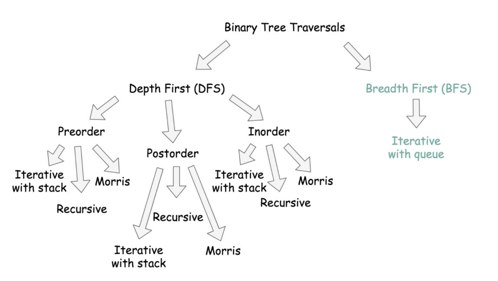
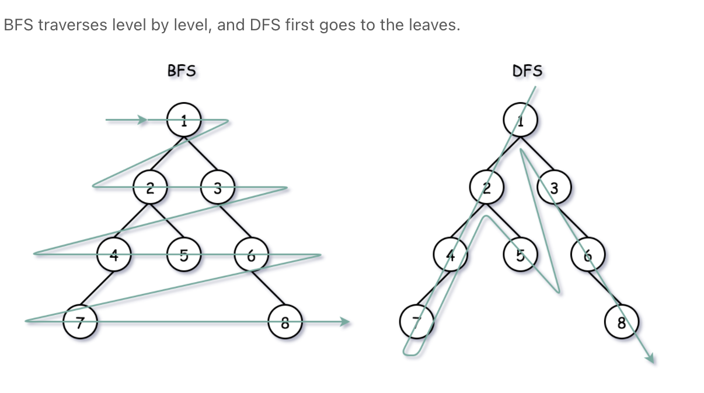

# Leetcode

Two types of trees majorly :   
BFS and DFS  
Their internal types  
And modes of implementation 

BFS traverses level by level whereas DFS travels down to length of the tree
towards its leaves.

